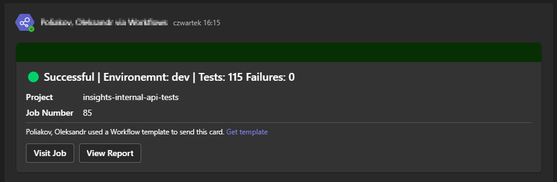
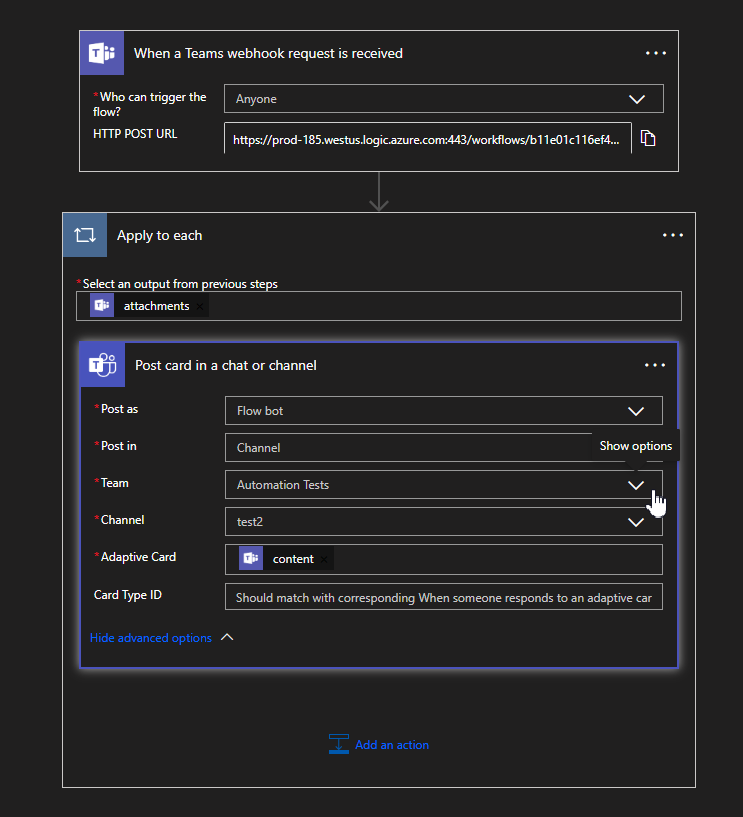

# CircleCI orb: teams-notification

This orb is designed to send notifications using Microsoft teams workflow API.

## Notification example:

## Teams workfow configurations:

## Commands

### Status

 <table>
 <th>PARAMETER</th>
 <th>DESCRIPTION</th>
 <th>REQUIRED</th>
 <th>DEFAULT</th>
<tr>
<td>teams_url</td>
 <td>Teams workflow URL</td>
 <td>YES</td>
 <td>-</td>
 </tr>
 <tr>
<td>failed_message</td>
 <td>Message that would be send if tests will be failed</td>
 <td>NO</td>
 <td>🔴 Failed</td>
 </tr>
  <tr>
<td>passed_message</td>
 <td>Message that would be send if tests will be passed</td>
 <td>NO</td>
 <td>🟢 Successful</td>
 </tr>
   <tr>
<td>report_url</td>
 <td> URL to test report. Button View Report become availible in the message if parameter setup. </td>
 <td>NO</td>
 <td></td>
 </tr>
 </table>

## Resources

[CircleCI Orb Registry Page](https://circleci.com/developer/orbs/orb/shureeck/teams-notification) - The official registry page of this orb for all versions, executors, commands, and jobs described.

[CircleCI Orb Docs](https://circleci.com/docs/orb-intro/#section=configuration) - Docs for using, creating, and publishing CircleCI Orbs.

### How to Contribute

We welcome [issues](https://github.com/shureeck/teams-notifications-orb/issues) to and [pull requests](https://github.com/shureeck/teams-notifications-orb/pulls) against this repository!

### How to Publish An Update

1. Merge pull requests with desired changes to the main branch.
   - For the best experience, squash-and-merge and use [Conventional Commit Messages](https://conventionalcommits.org/).
2. Find the current version of the orb.
   - You can run `circleci orb info <namespace>/<orb-name> | grep "Latest"` to see the current version.
3. Create a [new Release](https://github.com/<organization>/<project-name>/releases/new) on GitHub.
   - Click "Choose a tag" and _create_ a new [semantically versioned](http://semver.org/) tag. (ex: v1.0.0)
     - We will have an opportunity to change this before we publish if needed after the next step.
4. Click _"+ Auto-generate release notes"_.
   - This will create a summary of all of the merged pull requests since the previous release.
   - If you have used _[Conventional Commit Messages](https://conventionalcommits.org/)_ it will be easy to determine what types of changes were made, allowing you to ensure the correct version tag is being published.
5. Now ensure the version tag selected is semantically accurate based on the changes included.
6. Click _"Publish Release"_.
   - This will push a new tag and trigger your publishing pipeline on CircleCI.
